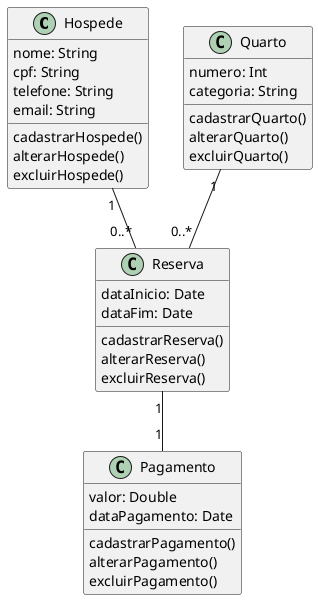
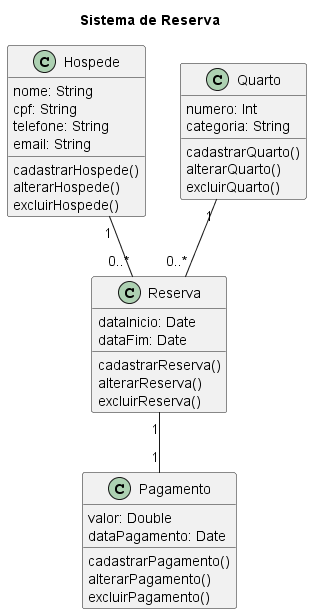

Modelar, a nível de Diagrama de Classe, os seguintes sistemas:
Atividade 1: Sistema de Reservas de Hotel
O sistema deve permitir o cadastro de hóspedes, quartos e as reservas feitas pelos hóspedes.

Cada quarto possui um número e uma categoria (simples, duplo, suíte). O hóspede pode fazer uma reserva para um quarto por um período de tempo, e cada reserva está associada a um pagamento.

1. Identidificao das classes

1.1. Hóspede
1.2. Quarto
1.3. Reserva
1.4. Pagamento

2. Atributos e Meteodos das Classes

2.1. Hóspede
- Atributos: nome, cpf, telefone, email
- Métodos: cadastrarHospede(), alterarHospede(), excluirHospede()

2.2. Quarto
- Atributos: numero, categoria
- Métodos: cadastrarQuarto(), alterarQuarto(), excluirQuarto()

2.3. Reserva
- Atributos: dataInicio, dataFim
- Métodos: cadastrarReserva(), alterarReserva(), excluirReserva()

2.4. Pagamento
- Atributos: valor, dataPagamento
- Métodos: cadastrarPagamento(), alterarPagamento(), excluirPagamento()

3. Identificar Relacionamentos

3.1. Hóspede - Reserva
- Um hóspede pode fazer várias reservas
- Uma reserva é feita por um hóspede

3.2. Quarto - Reserva
- Um quarto pode ter várias reservas
- Uma reserva é feita para um quarto

3.3. Reserva - Pagamento
- Uma reserva está associada a um pagamento
- Um pagamento está associado a uma reserva

4. Diagrama de Classe

