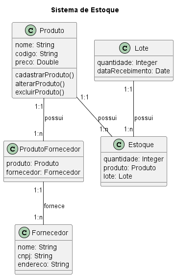

Sistema de Cadastro de Produtos em Estoque
O sistema deve gerenciar produtos, fornecedores e os lotes de produtos recebidos.

Cada produto possui informações como nome, código e preço. Os fornecedores fornecem possuem nome, CNPJ e endereço e fornecem produtos ao armazém. Cada produto pode ser recebido em múltiplos lotes, os quais têm quantidade e data de recebimento.

1. Identidificao das classes

1.1. Produto
1.2. Fornecedor
1.3. Lote

2. Atributos e Meteodos das Classes

2.1. Produto
- Atributos: nome, codigo, preco
- Métodos: cadastrarProduto(), alterarProduto(), excluirProduto()

2.2. Fornecedor
- Atributos: nome, cnpj, endereco

2.3. Lote
- Atributos: quantidade, dataRecebimento

3. Identificar Relacionamentos

3.1. Produto - Lote
- Um produto pode ser recebido em vários lotes
- Um lote é de um produto

3.2. Fornecedor - Produto
- Um fornecedor fornece vários produtos
- Um produto é fornecido por um fornecedor

4. Diagrama de Classe

